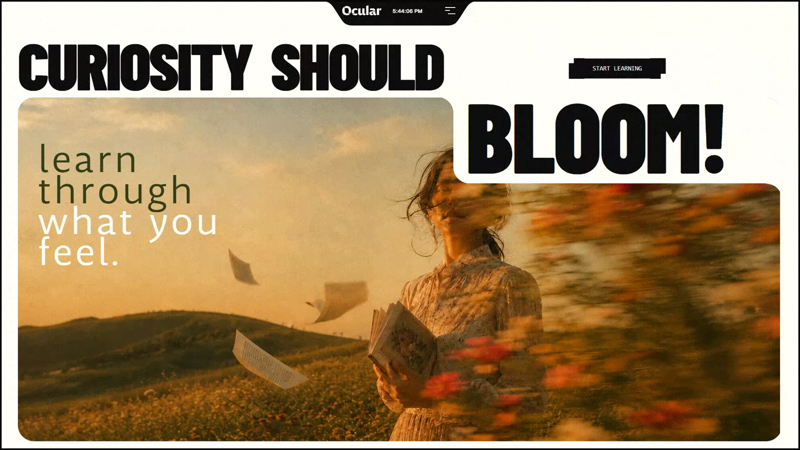
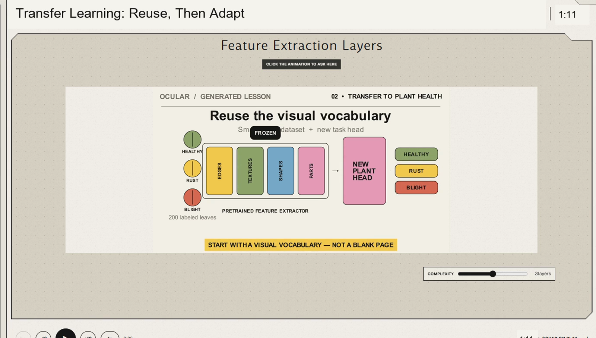
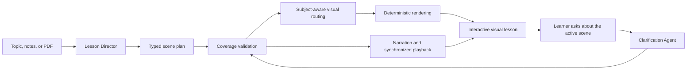

<div align="center">

# OCULAR

### Source in. Understanding out.

Turn a topic, rough notes, or a PDF into a narrated visual lesson a learner can see, hear, manipulate, and question.

**THE BETTER THE MODEL, THE BETTER THE EXPLANATION AND RESULT.**


</div>



## A visual lesson, generated inside Ocular

This transfer-learning scene was generated from the learner's prompt, routed through Ocular's verified rendering workflow, and displayed inside the interactive lesson studio. It shows reusable visual features from a pretrained network being transferred to a plant-disease classifier built from a small labeled dataset.



Most AI tutors return a fluent paragraph. General-purpose video models can make moving pixels, but an educational product needs something harder: an explanation whose objects, relationships, timing, narration, and interaction stay correct. Ocular builds that executable explanation.

## Ocular in 30 seconds

| Question | Answer |
| --- | --- |
| **Who is it for?** | Students and self-directed learners who understand a mechanism better when they can see it unfold and interact with it. |
| **What is broken today?** | Text answers are static; manual animation is slow; generative video is costly, difficult to control, and can look convincing while showing the wrong transition or physics. |
| **What does Ocular do?** | Turns a topic, notes, or PDF into narrated, manipulable 2D lesson scenes, then creates a focused follow-up scene when the learner asks a question. |
| **What is the innovation?** | Ocular generates a typed teaching plan, not raw pixels. Verified domain tools execute the plan using diagrams, plots, simulations, maps, molecules, timelines, and scientific animation. |
| **How many agents?** | **Two:** a Lesson Director and a Clarification Agent. Rendering, validation, narration, and playback are tools used by the workflow, not inflated into extra agents. |
| **What improved?** | On ten fixed cases, the direct-prompt baseline produced 0/10 runnable visual lessons; Ocular produced 10/10. |

## Problem & user value

### Problem 1: generative video is the wrong primitive for on-demand teaching

An educational scene must preserve identity, causality, sequence, labels, quantities, and physical relationships. A visually attractive clip is not useful if a chromosome separates incorrectly, an arrow reverses direction, a graph changes meaning between frames, or a model forgets which layer was frozen.

Current evidence makes both the cost and reliability problem concrete:

| Evidence | What it means for an educational product |
| --- | --- |
| As accessed on 31 August 2026, Google's Gemini API price for Veo 3.1 Standard with audio is **$0.40 per generated second** at 720p or 1080p. That is **$24 for 60 seconds** and a **$120 five-minute equivalent** before retries. Even the 720p Fast tier is $0.10 per second, or a $30 five-minute equivalent. ([Google AI pricing](https://ai.google.dev/gemini-api/docs/pricing)) | Per-second generation makes personalized lessons costly to create repeatedly, especially when a failed scene must be regenerated. The five-minute figures are transparent extrapolations from the published per-second rates, not a claim that one request produces a continuous five-minute clip. |
| TC-Bench found that most evaluated video generators completed **less than 20% of requested compositional changes** across time. ([TC-Bench paper](https://arxiv.org/abs/2406.08656)) | A model may render appealing frames without completing the exact transition the lesson is supposed to teach. |
| T2VPhysBench reported that every evaluated model scored below **0.60 average compliance** in each tested physical-law category. ([T2VPhysBench paper](https://arxiv.org/abs/2505.00337)) | Visual realism is not the same as instructional or physical correctness. |

Ocular therefore does **not** call a text-to-video API for every lesson. It uses a language model for instructional planning and narration, then renders reusable 2D objects and motion locally through bounded, inspectable tools. This removes the per-second generative-video bill while making each relationship selectable, testable, and reproducible. Text-model, narration, and local compute costs still exist and depend on the selected model and deployment.

### Problem 2: text alone does not make every mechanism understandable

This is not a claim that every learner needs the same format. It is a claim that some ideas are inherently easier to understand when change, space, scale, flow, and cause are shown instead of merely described.

| Research signal | Why it matters |
| --- | --- |
| UNESCO reports that **57% of children worldwide lack basic skills**. ([UNESCO, 2025](https://www.unesco.org/en/articles/what-we-stand-lose-costs-children-and-youth-not-learning-2030)) | The global learning problem is not simply access to more text; many learners are not reaching foundational understanding. |
| UNESCO reports that **739 million adults** still lack basic literacy skills. ([UNESCO literacy data, 2025](https://www.unesco.org/en/literacy)) | Text-only interfaces exclude or burden a very large population. Ocular does not claim to solve literacy by itself, but it demonstrates why explanation should not depend on prose alone. |
| The World Bank and partners estimated that **70% of ten-year-olds in low- and middle-income countries** could not understand a simple written text after the pandemic shock. ([World Bank](https://www.worldbank.org/en/news/press-release/2022/06/23/70-of-10-year-olds-now-in-learning-poverty-unable-to-read-and-understand-a-simple-text)) | A short prompt followed by narration and visual demonstration can reduce dependence on long blocks of reading. |
| A meta-analysis of **26 studies and 76 comparisons** found a medium overall learning advantage for instructional animation over static pictures (`d = 0.37`), rising for representational animation (`d = 0.40`). ([Hoffler and Leutner](https://doi.org/10.1016/j.learninstruc.2007.09.013)) | Purposeful motion can help when it directly represents the process being learned rather than serving as decoration. |

Ocular deliberately avoids the unsupported claim that a fixed percentage of people are "visual learners." A major review found virtually no evidence that matching instruction to a labeled learning style improves outcomes. ([Pashler et al.](https://doi.org/10.1111/j.1539-6053.2009.01038.x)) Ocular instead uses a stronger principle: **match the representation to the subject**. Use a graph for a derivative, a molecule for chemistry, a map for movement, a network for breadth-first search, and a timeline for history.

### Who experiences the bottleneck?

- A beginner who reads a correct answer but still cannot picture what changes.
- A learner working in a second language who benefits from synchronized narration, labels, and visible relationships.
- A student studying mathematics, science, computing, economics, geography, or history where a mechanism unfolds over time.
- A teacher or tutor who cannot manually script, illustrate, animate, narrate, and synchronize a custom explanation for every question.

### Why is solving it valuable?

Ocular compresses that production workflow into one learner action. The result is not another answer to read and not an opaque generated clip. It is a lesson the learner can inspect, control, manipulate, and challenge at the exact scene where understanding breaks down.

## Innovation: generate the explanation, not the pixels

| Conventional text-to-video workflow | Ocular |
| --- | --- |
| Generates pixels directly from a prompt. | Generates a typed teaching plan with objectives, objects, connections, narration, animation beats, interaction, and a renderer contract. |
| Charges by generated duration and often needs costly retries. | Avoids a generative-video API; text planning, narration, and deterministic local rendering are independent costs. |
| The scene is flattened into frames. | Objects remain named, selectable, and manipulable. |
| Prompt adherence and physics are difficult to inspect. | Equations, molecule strings, coordinates, graphs, networks, and templates are validated before playback. |
| Clarification usually means generating another clip. | The Clarification Agent appends one focused scene using the exact doubt and current lesson context. |
| The same visual model is asked to handle every subject. | A subject router sends each scene to the appropriate scientific or diagrammatic tool. |

## Agent solution & engineering

Ocular has **exactly two specialized agents** supported by deterministic tools. They are structured-output reasoning roles implemented in server-side API routes; the application orchestrates their handoffs and retains the lesson as working context. Rendering, validation, narration, and playback are intentionally described as tools rather than being mislabeled as extra agents.

| Component | Role | Why it exists |
| --- | --- | --- |
| **Agent 1: Lesson Director** ([route](frontend/app/api/lesson/route.ts)) | Converts the learner's source into a typed lesson containing scene objectives, narration, visual objects, connections, animation beats, interactions, and renderer specifications. | Separates instructional reasoning from rendering and gives every downstream tool an executable contract. |
| **Agent 2: Clarification Agent** ([route](frontend/app/api/lesson/refine/route.ts)) | Receives the exact learner doubt plus the active scene and creates one simpler, focused follow-up scene. | Corrects the point of confusion without replacing the lesson or returning a generic summary. |
| **Coverage validator** | Validates scene structure and fills sparse narration-linked animation timelines before playback. | Prevents structurally incomplete model output from reaching the learner. |
| **Visual router and renderer** ([API](frontend/app/api/render/route.ts), [engine](backend/renderer/scene.py)) | Selects the appropriate renderer and executes typed plans with Manim and specialized scientific libraries. | Avoids one generic diagram style and makes visual execution bounded and reproducible. |
| **Narration tool** ([route](frontend/app/api/tts/route.ts)) | Produces a consistent voice for each prepared scene. | Lets the learner hear the explanation while watching the relevant visual change. |
| **Studio orchestrator** ([component](frontend/app/learn/LearningStudio.tsx)) | Synchronizes narration, subtitles, visual beats, seeking, speed, object selection, manipulation, and clarification handoffs. | Delivers one coherent experience rather than disconnected assets. |



### How the two agents work

**Agent 1 - Lesson Director**

1. Receives a topic, notes, or extracted PDF text.
2. Identifies the teaching objective and the minimum useful scene sequence.
3. Returns schema-constrained JSON: narration, named visual elements, connections, timed animation beats, a manipulation, and a renderer specification for every scene.
4. Passes the plan to deterministic coverage validation. Invalid structured output is repaired or retried against the configured model fallback list.
5. Hands valid scenes to the subject router, renderer, narration tool, and learner studio.

**Agent 2 - Clarification Agent**

1. Receives the learner's exact doubt, the selected scene, and the original lesson context.
2. Creates one smaller visual explanation aimed only at that misunderstanding; it does not rewrite the whole lesson.
3. Passes the new scene through the same schema, timeline, rendering, and narration checks.
4. Appends the prepared clarification to the lesson so the learner can compare both explanations.

### Subject-aware rendering

Ocular does not use the transfer-learning drawing as a universal template. The Lesson Director selects from ten domains, ten renderer engines, and nineteen typed templates. The backend test suite exercises 21 renderer cases.

| Subject or mechanism | Visual forms | Renderer/library path |
| --- | --- | --- |
| **Mathematics** | Function graphs, derivatives, integrals, differential equations, geometry, matrices, and vector fields | Manim, SymPy, NumPy |
| **Physics and measured science** | Scientific plots, distributions, vector fields, differential systems, and parameter changes | Manim, SciPy, NumPy |
| **Computing and connected systems** | Graphs, node traversal, dependencies, and breadth-first search | NetworkX, Manim |
| **Queues and processes** | Ordered pipelines, events, state changes, and discrete processes | SimPy, Manim |
| **Chemistry** | Molecules generated from validated SMILES structures, atoms, and bonds | RDKit, Manim |
| **Biology** | Phylogenetic trees, chromosomes, spindle fibers, cell division, and local biological illustrations | Biopython, Manim |
| **Astronomy** | Orbital paths, bodies, motion, and relative scale | Manim orbit template; Astropy is installed and version-checked in the renderer runtime |
| **Geography** | Coordinates, routes, regions, and movement across maps | GeoPandas, Shapely, Manim |
| **Economics** | Supply-demand curves, distributions, measured change, and process relationships | SymPy, SciPy, Manim |
| **History and general concepts** | Timelines, causal sequences, labeled diagrams, and local subject illustrations | Manim and the local illustration engine |

All educational visuals are generated locally from the typed plan. External image fetching was removed after it introduced availability, provenance, and subject-fidelity risk.

### Model quality principle

**The better the model, the better the explanation and result.** Stronger reasoning, instruction following, and structured-output reliability generally improve lesson sequencing, example selection, visual planning, narration, and clarification quality. Ocular's typed contracts and deterministic tools provide reliability, but they do not remove the value of a capable model: the model decides what should be taught, while the tools make that plan executable and verifiable.

The text-model fallback order is defined in [`frontend/app/api/lesson/gemini-json.ts`](frontend/app/api/lesson/gemini-json.ts). If a model is unavailable or returns invalid structured output, Ocular repairs valid partial JSON where possible, tries the next configured model, and finally returns an honest local fallback rather than a blank workspace.

## End-to-end learner experience

1. The learner opens the full-screen studio and supplies a topic, notes, or a PDF.
2. The Lesson Director turns the source into a lesson with only the scenes needed by the material.
3. Ocular validates the plan and prepares each subject-specific visual before exposing it for playback.
4. The learner plays, pauses, seeks, changes speed, follows synchronized subtitles, selects visual objects, and performs a direct manipulation.
5. If a scene is unclear, the learner asks a question at that scene.
6. The Clarification Agent appends a simpler follow-up scene, which passes through the same validation, rendering, and narration workflow.
7. If one optional tool is temporarily unavailable, valid teaching work is preserved and the experience degrades gracefully instead of discarding the lesson.

The workflow is self-contained from source to usable learning artifact. The original lesson remains available throughout clarification, so the learner can compare the first explanation with the targeted follow-up.

## Measured improvement

### Primary metric

**Runnable visual lesson completion** is the percentage of fixed cases that produce all of the following:

1. at least two scenes;
2. meaningful narration in every scene;
3. at least two selectable visual objects per scene;
4. at least four synchronized animation beats per scene;
5. one direct manipulation per scene; and
6. a valid renderer engine and template per scene.

This metric reflects the promised learner outcome. Concept coverage is also reported, but a fluent paragraph cannot pass as a runnable lesson.

### Fair baseline

The baseline receives the same topic and keyword rubric but uses only one direct Gemini instruction:

```text
Explain this clearly to a beginner: <case>
```

It has no typed scene schema, renderer, narration workflow, interaction contract, verification, or clarification agent. This gives the baseline a real latency advantage, which the results report rather than hide.

The executable baseline is deliberately the common low-cost alternative: ask a general-purpose model for an explanation. Ocular does **not** claim that its ten-case run is a head-to-head evaluation against Veo or another commercial video generator. The pricing and benchmark results above are external evidence for the product-design problem; the repository evaluation isolates whether Ocular's agent workflow produces a more usable artifact than a direct prompt on the same task.

### Challenging case: transfer learning

The fixed challenging prompt is:

> Explain transfer learning to a beginner. Show how a neural network trained to recognize everyday objects can reuse learned visual features to classify plant diseases with only a small labeled dataset. Contrast freezing the feature extractor with fine-tuning, and explain when transfer learning helps or fails.

A successful result must cover reusable features, knowledge transfer, frozen feature extraction, fine-tuning, small-data value, and domain mismatch.

An early development run exposed sparse animation timelines, so Ocular added deterministic narration-linked timeline completion. The later reproducibility audit exposed a separate issue: one differential-equation response contained only one scene, producing 9/10. That complete failed run is preserved, the minimum two-scene contract is now verified and retried, and the same ten cases then passed 10/10 without relaxing the rubric.

## Improvement Changelog

Every stage used the same target: convert a learner's source into a lesson they can see, hear, manipulate, and question.

| Stage | What changed and why | Evidence | Decision / learning |
| --- | --- | --- | --- |
| Baseline | Started with a polished landing experience and a one-prompt prose explanation. | Runnable lesson completion: 0%. No structured scenes, narration, manipulation, verification, or follow-up. | Keep the visual identity; replace the text-answer workflow. |
| Iteration 1 | Added typed lesson planning so one source could become multiple teachable scenes. | Topics, notes, and PDFs produced objectives, narration, elements, connections, and interactions; visuals were still generic. | Keep typed planning and improve execution. |
| Iteration 2 | Added browser-native animation, synchronized narration and subtitles, playback controls, and manipulation. | The lesson became playable, but generic drawings still lacked subject fidelity. | Keep interaction and add subject-aware tools. |
| Removed experiment | Added internet images for fast subject recognition. | Assets were inconsistent, created provenance and availability risk, and illustrated topics without demonstrating mechanisms. | Remove internet image fetching; create educational visuals locally. |
| Iteration 3 | Routed typed scenes into deterministic subject renderers. | The strict backend suite passed 21/21 templates; domain-specific lessons showed mechanisms rather than generic boxes. | Keep creativity in planning and determinism in execution. |
| Iteration 4 | Added pre-rendering, validation before playback, and explicit renderer fallback. | Incomplete states stopped reaching the learner; renderer outages degraded to prepared diagrams instead of blank output. | Verify before playback and preserve useful partial results. |
| Iteration 5 | Changed clarification from destructive replacement to an appended scene based on the exact doubt. | The original explanation remains available while the focused clarification is prepared. | Preserve learning history instead of overwriting it. |
| Resilience check | Tested clarification while narration quota was unavailable. | A valid clarification was initially blocked by an unrelated audio failure. | Decouple tools so a narration outage cannot discard valid teaching work. |
| Final | Combined the two agents, typed contracts, deterministic rendering, synchronized narration, manipulation, verification, and graceful fallback. | Ocular passed 10/10 fixed cases; the renderer suite passed 21/21 templates. | The main contribution is the verified handoff from creative agent planning to deterministic visual execution. |

The detailed record is preserved in [`IMPROVEMENT_CHANGELOG.md`](IMPROVEMENT_CHANGELOG.md).

## Reproduce from a clean environment

### Requirements and tested toolchain

- Node.js 22.11 or newer (**tested: 22.11.0**)
- pnpm 9 (**tested: 9.15.4**; exact JavaScript dependencies are locked in `frontend/pnpm-lock.yaml`)
- Python 3.12 (**tested renderer environment: 3.12.12**)
- uv (**tested: 0.9.18**; exact Python dependencies are locked in `backend/uv.lock`)
- FFmpeg (**tested: 7.1**) and the system libraries required by Manim
- A Gemini API key

### 1. Clone and configure

```bash
git clone https://github.com/AashishThakuri/micro1-agentic-workflows-hackathon.git
cd micro1-agentic-workflows-hackathon
cp backend/.env.example backend/.env
```

On Windows PowerShell, use `Copy-Item backend/.env.example backend/.env` instead of `cp`.

Set the key in `backend/.env`:

```dotenv
GEMINI_API_KEY=your_gemini_api_key_here
```

Credentials are read server-side and are never exposed to the browser.

### 2. Install and run

```bash
uv sync --project backend
cd frontend
pnpm install
pnpm dev
```

Open `http://localhost:3000`. The development command starts both the web application and the local precision renderer.

First-time setup may take several minutes because scientific and animation dependencies must be installed. A typical lesson plan takes approximately 8 to 20 seconds before subject rendering and narration, depending on model availability and source length. Gemini cost depends on the selected models and the account's current pricing. The workflow makes a planning request for a lesson, a refinement request for each learner doubt, renderer requests for precision scenes, and narration requests for generated scenes.

### 3. Run the fair comparison

Keep Ocular running, then from the repository root execute:

```bash
node evaluation/run.mjs --output evaluation/artifacts/reproduction.json
```

Expected recorded headline result:

```text
Direct-prompt baseline: 0/10 runnable visual lessons
Ocular:                 10/10 runnable visual lessons
Average keyword coverage: baseline 95%, Ocular 98%
```

The harness prints all cases and exits with a nonzero status if any Ocular case fails the runnable-lesson contract. Set `OCULAR_URL` only when evaluating an origin other than `http://localhost:3000`.

The output artifact contains the complete baseline text, complete Ocular lesson JSON, per-check rubric results, model selection, latencies, and the computed summary. To independently rescore the frozen submission run without an API key or network access:

```bash
node evaluation/verify.mjs evaluation/artifacts/run-2026-08-31.json
```

Expected verifier result: `10` cases, baseline runnable `0`, Ocular runnable `10`, keyword coverage `95%` for the baseline and `98%` for Ocular, and an empty `mismatches` array. The frozen raw run is the evidence behind [`evaluation/RESULTS.md`](evaluation/RESULTS.md); the Markdown table is not treated as the source of truth.

### 4. Verify deterministic rendering

```bash
cd backend
uv run pytest -q
```

Expected result: all 21 renderer templates pass.

## Agent trajectories and evidence

Representative sanitized trajectories show instructions, inputs, tool calls, tool results, validation, retries, and human checkpoints without exposing credentials or hidden reasoning:

- [`traces/lesson-director-transfer-learning.md`](traces/lesson-director-transfer-learning.md)
- [`traces/clarification-agent-transfer-learning.md`](traces/clarification-agent-transfer-learning.md)
- [`traces/README.md`](traces/README.md)
- [`evaluation/RESULTS.md`](evaluation/RESULTS.md) - all ten submitted results and challenging-case analysis
- [`evaluation/artifacts/run-2026-08-31.json`](evaluation/artifacts/run-2026-08-31.json) - complete frozen baseline and Ocular outputs behind every submitted score
- [`evaluation/artifacts/failed-run-2026-08-31-before-minimum-scene-check.json`](evaluation/artifacts/failed-run-2026-08-31-before-minimum-scene-check.json) - preserved 9/10 run that exposed the reliability gap
- [`evaluation/VALIDATION.md`](evaluation/VALIDATION.md) - exact commands and observed lint, build, renderer-test, and score-verification outputs

## Repository structure

```text
frontend/    React, TypeScript, Vinext, Gemini agent routes, playback, and the learner studio
backend/     FastAPI deterministic renderer, subject libraries, generated media, and tests
evaluation/  Fixed cases, direct-prompt baseline, executable rubric, and complete results
traces/      Sanitized representative trajectories for both agents
docs/        Supporting submission materials
```

## Safety, privacy, and responsible use

- Credentials and `.env` files are excluded from Git.
- The browser never receives the Gemini API key.
- Internet image fetching was removed; educational visuals are generated locally.
- Mathematical expressions use a restricted parser instead of unrestricted evaluation.
- Tool failures are isolated so one unavailable service does not silently destroy valid work.
- Ocular teaches and explains; it does not take consequential actions on a learner's behalf.

## Main failure mode and hot take

The most important failure was **generic visual confidence**: a diagram could look polished while teaching the wrong mechanism. Early cell and anatomy lessons demonstrated that correct labels placed on vague geometry were not enough.

The fix was not merely a larger prompt. Ocular moved to typed plans, deterministic subject routing, and verification before playback.

> **Hot take:** do not ask an educational agent to be the illustrator, animator, narrator, and verifier at once. Let the model decide what must be taught, then make specialized deterministic tools execute and verify the plan. Constraint is what makes the creativity dependable.

## License

Hackathon submission by Aashish Thakuri. 
